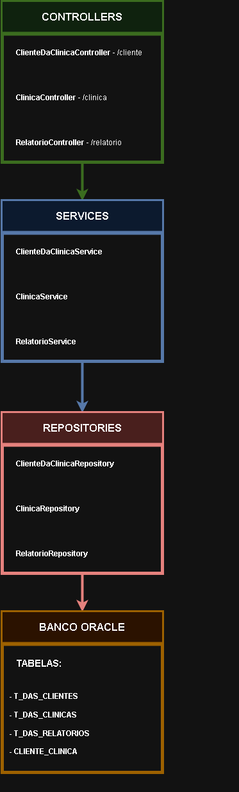
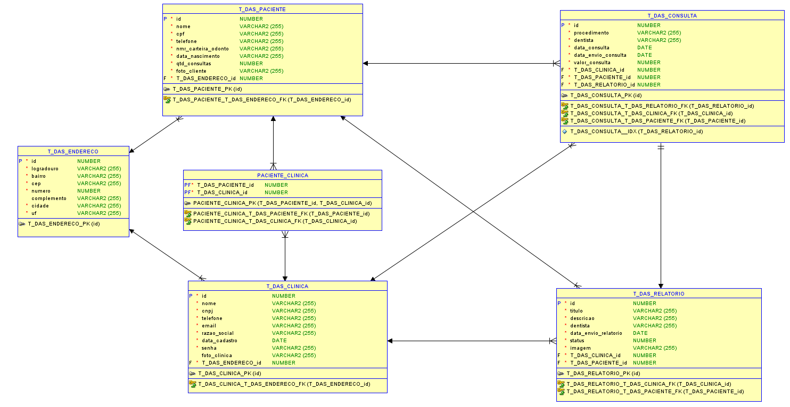
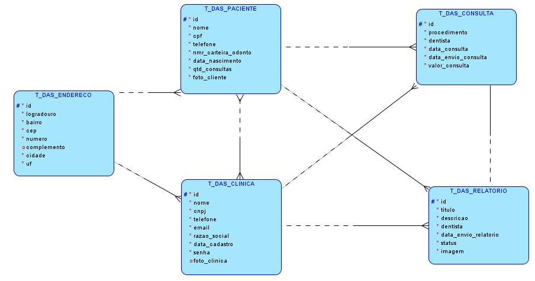
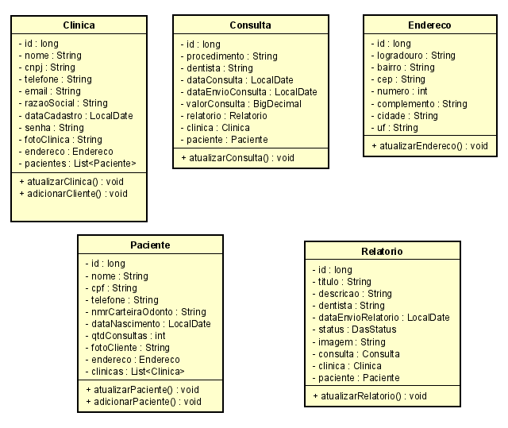
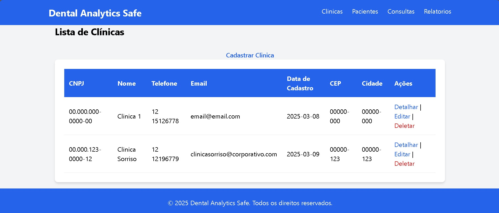
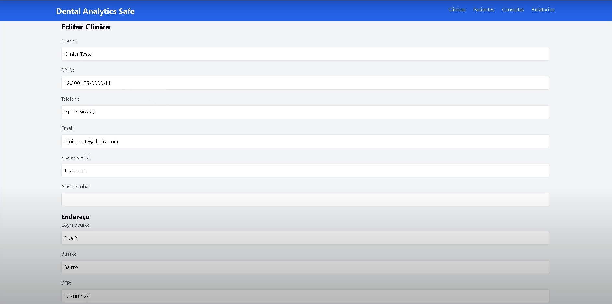
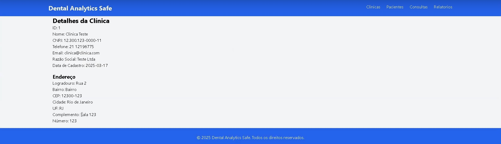
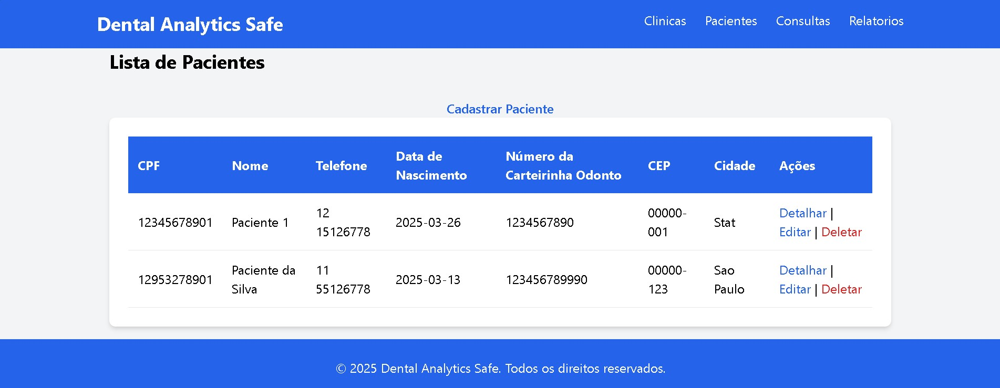
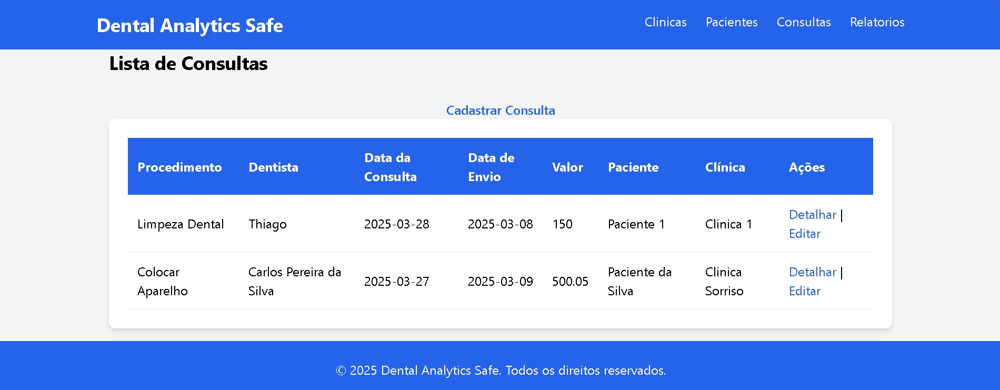
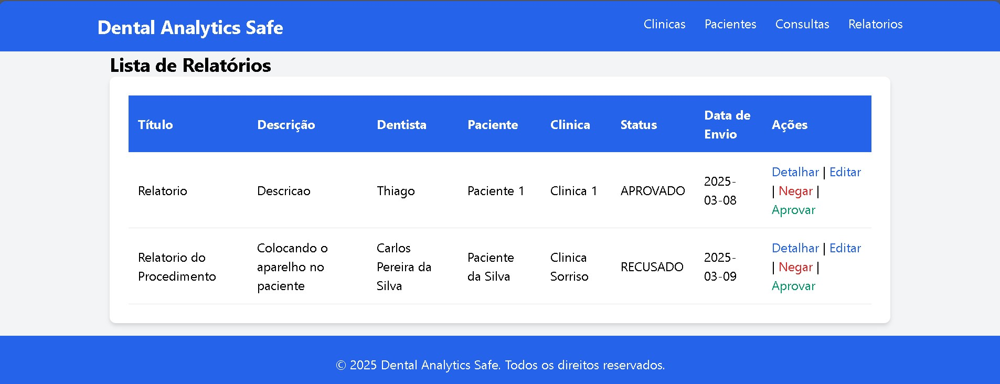

# Dental Analytics Safe

## 1. Integrantes
- RM554012 Gabriel Pescarolli Galiza  
- RM554258 Guilherme Gambarão Baptista

### Descrição do Projeto
Nosso projeto consiste em uma API desenvolvida em Java utilizando o framework Spring Boot para gerenciar clientes e clínicas odontológicas, incluindo a criação e consulta de relatórios de consulta. A API segue a arquitetura monolítica permitindo a criação, atualização e listagem de clientes e clínicas, além do gerenciamento de relatórios clínicos, incluindo um front-end gerenciado pelo Thymeleaf.

### Tecnologias Utilizadas
- **Java 17**
- **Spring Boot**
- **JPA / Hibernate**
- **Prometheus / Grafana**
- **Thymeleaf**
- **Banco de Dados Oracle**
- **Maven**

### Sumário
- [Integrantes](#1-integrantes)
- [Passos para rodar a Aplicação](#2-passos-para-rodar-a-aplicação)
- [Diagramas](#31-imagens)
- [Relacionamento e Constraints](#32-relacionamentos-e-constraints)
- [Video](#4-vídeo-apresentando-a-aplicação)
- [Endpoints Disponíveis](#5-endpoints-disponíveis)
- [Testes](#6-testes-)
- [Prometheus e Grafana](#7-integração-spring-boot-actuator-com-prometheus-e-grafana)

## 2. Passos para rodar a aplicação:
1. Clone o repositório:  
   ```bash
   git clone https://github.com/brielpg/Challenge_Java_01.git

2. Abra o diretório do projeto clonado:  
    ```bash
   cd Challenge_DAS_JAVA

3. Execute o comando para subir os serviços do Prometheus e Grafana
    ```bash
   docker-compose up
   
4. Execute o comando para gerar um .jar da aplicação  
    ```bash
   mvn clean package

5. Acesse o diretório target para acessar o .jar  
    ```bash
    cd target

6. Rode a aplicação
    ```bash
   java -jar Challenge01-0.0.1-SNAPSHOT.jar  

## 3. Imagem do Diagrama

### 3.1 Imagens:





















### 3.2 Relacionamentos e Constraints:

#### 3.2.1 Relacionamentos:  
Um cliente pode estar relacionado a vários relatórios, mas cada relatório pertence a apenas um cliente.  
Uma clínica pode estar relacionado a vários relatórios, mas cada relatório pertence a apenas uma clínica.  
Um cliente pode estar relacionado a várias clínicas e uma clínica pode estar relacionada a vários clientes.  

#### 3.2.2 Chaves Estrangeiras:  
cliente_id e clinica_id no relatório referenciam as tabelas Cliente e Clínica, garantindo que um relatório sempre esteja associado a um cliente e a uma clínica.  
Clinica e Cliente possuem uma tabela de junçao com os IDs cliente_id e clinica_id que são chaves estrangeiras que referenciam Cliente e Clínica, respectivamente.  

## 4. Vídeo apresentando a aplicação
Link do vídeo: https://www.youtube.com/watch?v=6F3w8023OTM

## 5. Endpoints Disponíveis

### 5.1. Endpoint de Clinica - /clinica
**GET** /clinica/create - Acessa a página para cadastro de clínicas  
**GET** /clinica/update/id - Acessa a página para atualizar as informaçoes de uma clínica  
**GET** /clinica - Acessa a página que lista todas as clínicas  
**GET** /clinica/cnpj - Acessa a página que lista as informaçoes de uma clínica  
**GET** /clinica/delete/id - Endpoint para deletar uma clínica  
**POST** /clinica - Endpoint para criar uma nova clínica  
**POST** /clinica/update/id - Endpoint para atualizar informaçoes da clínica  

### 5.2. Endpoint de Paciente - /paciente
**GET** /paciente/create - Acessa a página para cadastro de paciente  
**GET** /paciente/update/cpf - Acessa a página para atualizar as informaçoes de um paciente  
**GET** /paciente - Acessa a página que lista todos os pacientes  
**GET** /paciente/cpf - Acessa a página que lista as informaçoes de um paciente  
**GET** /paciente/delete/id - Endpoint para deletar um paciente  
**POST** /paciente - Endpoint para criar um novo paciente  
**POST** /paciente/update/cpf - Endpoint para atualizar informaçoes de paciente  

### 5.3. Endpoint de Relatorio - /relatorio
**GET** /relatorio - Acessa a página para listar todos os relatorios  
**GET** /relatorio/id - Acessa a página para listar um relatorio por id  
**GET** /relatorio/negar/id - Endpoint para negar o pedido de um relatorio  
**GET** /relatorio/aprovar/id - Endpoint para aprovar o pedido de um relatorio  
**GET** /relatorio/update/id - Acessa a página para atualizar as informaçoes de um relatório  
**POST** /relatorio/update/id - Endpoint para atualizar as informaçoes de um relatorio  

### 5.4. Endpoint de Consulta - /consulta
**GET** /consulta/create - Acessa a página para criar uma consultas  
**GET** /consulta - Acessa a página para listar todas as consultas  
**GET** /consulta/id - Acessa a página para listar as informaçoes de uma consulta  
**GET** /consulta/update/id - Acessa a página para atualizar as informaçoes de uma consulta  
**POST** /consulta - Endpoint para criar uma nova consulta  
**POST** /consulta/update/id - Endpoint para atualizar as informaçoes de uma consulta  

## 6. Testes  
Os testes podem ser feitos via `Postman` através do arquivo collection postman disponibilizado, `"Challenge Odontoprev.postman_collection.json"`, ou nas próprias páginas thymeleaf com os exemplos abaixo.

### Endereço
```
Logradouro:     Rua das Flores
Bairro:         Centro
CEP:            00000-123
Cidade:         São Paulo
UF:             SP
Complemento:    Apto 101
Número:         12
```

### Cadastro de Clínica  
```
Nome:           Clinica Sorriso
CNPJ:           12.323.123-0000-11
Telefone:       11 12196779
Email:          sorriso@clinica.com
Razão Social:   Clinica Sorriso Ltda
Senha:          123!@#Senha
```

### Cadastro de Paciente
```
Nome:                      Gabriel Galiza
CPF:                       12953568923
Telefone:                  11 55126778
Data de Nascimento:        2000-02-10
Número da Carteira Odonto: 123456789
```

### Cadastro de Consulta
```
Procedimento:       Limpeza Dental
Dentista:           Dr. Gabriel
Data da Consulta:   2025-03-19
Valor da Consulta:  123456789
Clínica ID:         1
Paciente CPF:       12953568923
```

### Relatório da Consulta
```
Título:         Consulta de Rotina
Descrição:      O paciente realizou uma avaliação completa da saúde bucal. O dentista identificou uma pequena cárie em um dos molares e realizou a aplicação de flúor para fortalecimento do esmalte. Uma próxima consulta foi agendada para acompanhamento e possível tratamento restaurador.
Imagem:         www.imagem.com
```

## 7. Integração Spring Boot Actuator com Prometheus e Grafana

### 7.1 Endpoints

Alguns dos Endpoints relacionados ao actuator disponíveis.

| Endpoint   | Descrição                           |
| :---------- | :---------------------------------- |
| `/actuator	` | Lista todos os endpoints disponíveis. |
| `/actuator/health	` | Retorna o estado da aplicação (UP/DOWN). |
| `/actuator/info	` | Exibe informações da aplicação. |
| `/actuator/metrics	` | Lista todas as métricas disponíveis. |
| `/actuator/metrics/{nome}	` | Exibe dados de uma métrica específica, como 'jvm.memory.used' |
| `/actuator/prometheus	` | Exibe métricas formatadas para o Prometheus. |

### 7.2 Configuração do Grafana

1. Faça login (usuário padrão: admin, senha: admin)  
2. Adicione uma nova fonte de dados:  
   - Tipo: Prometheus  
   - URL: http://prometheus:9090 (endereço padrão do Prometheus)
3. Importe um dashboard para Spring Boot Actuator:  
   - Vá em "Create" > "Import"  
   - Use o ID do dashboard oficial: 4701 (Spring Boot Actuator Metrics)  
   - Configure a fonte de dados Prometheus criada  

### 7.3 Testando a Integração Localmente

Antes de testar a integração, volte para o passo a passo inicie a aplicação e suba os serviços do Prometheus
e do Grafana usando o comando `docker-compose up`.

1. Inicie a aplicação (`java -jar Challenge01-0.0.1-SNAPSHOT.jar`)
2. Acesse `http://localhost:8080/actuator/prometheus` para verificar as métricas expostas  
3. Acesse `http://localhost:3000` para abrir o Grafana e visualizar o dashboard  

---