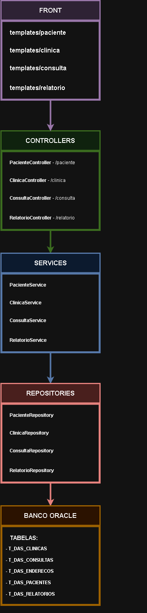

# Dental Analytics Safe

## 1. Integrantes
- RM552798 Gabriel Fossatti Beltran  
- RM554012 Gabriel Pescarolli Galiza  
- RM554258 Guilherme Gambarão Baptista

### Descrição do Projeto
Nosso projeto consiste em uma API desenvolvida em Java utilizando o framework Spring Boot para gerenciar clientes e clínicas odontológicas, incluindo a criação e consulta de relatórios de consulta. A API permite a criação, atualização e listagem de clientes e clínicas, além de autenticação de clínicas e gerenciamento de relatórios clínicos.

### Tecnologias Utilizadas
- **Java**
- **Spring Boot**
- **JPA / Hibernate**
- **Banco de Dados Oracle**
- **Maven**

## 2. Passos para rodar a aplicação:
1. Clone o repositório:  
   ```bash
   git clone https://github.com/brielpg/Challenge_Java_01.git

2. Abra o projeto na sua IDE de preferência 
3. Se necessário troque os valores das variáveis de ambiente no arquivo application.properties  
    ```bash
    spring.datasource.url=URL-DO-SEU-BANCO
    spring.datasource.username=USUARIO
    spring.datasource.password=SENHA
    spring.jpa.hibernate.ddl-auto=create
4. Compile e execute o projeto  

## 3. Imagem do Diagrama

### 3.1 Imagens:




### 3.2 Breve explicação dos Relacionamentos e Constraints:

#### 3.2.1 Relacionamentos:  
Um cliente pode estar relacionado a vários relatórios, mas cada relatório pertence a apenas um cliente.  
Uma clínica pode estar relacionado a vários relatórios, mas cada relatório pertence a apenas uma clínica.  
Um cliente pode estar relacionado a várias clínicas e uma clínica pode estar relacionada a vários clientes.  

#### 3.2.2 Chaves Estrangeiras:  
cliente_id e clinica_id no relatório referenciam as tabelas Cliente e Clínica, garantindo que um relatório sempre esteja associado a um cliente e a uma clínica.  
Clinica e Cliente possuem uma tabela de junçao com os IDs cliente_id e clinica_id que são chaves estrangeiras que referenciam Cliente e Clínica, respectivamente.  

## 4. Vídeo apresentando a Proposta Tecnológica
Link do vídeo: https://www.youtube.com/watch?v=FlKK-erlEGM&t=4s

## 5. Endpoints Disponíveis

### 5.1. Endpoint de Clinica - /clinica
**POST** /clinica - cria uma clínica  
**POST** /clinica/login - login da clínica  
**PUT**  /clinica - atualiza informacoes da clinica  
**GET**  /clinica - lista todas as clinicas

### 5.2. Endpoint de Cliente - /cliente
**POST** /cliente - cria um cliente/paciente  
**PUT** /cliente - atualiza informacoes do cliente/paciente  
**GET** /cliente - lista todos os clientes/pacientes  
**GET** /cliente/cpf - lista um cliente por cpf  

### 5.3. Endpoint de Relatorio - /relatorio
**POST** /relatorio - cria um relatorio  
**PUT** /relatorio - atualiza informacoes de um relatorio  
**GET** /relatorio - lista todos os relatorios  
**GET** /relatorio/clinica/id - lista os relatorios de uma clinica  
**GET** /relatorio/cliente/id - lista os relatorios de um cliente/paciente  
**DEL** /relatorio/negar/id - nega o pedido de um relatorio  
**DEL** /relatorio/aprovar/id - aprova o pedido de um relatorio  